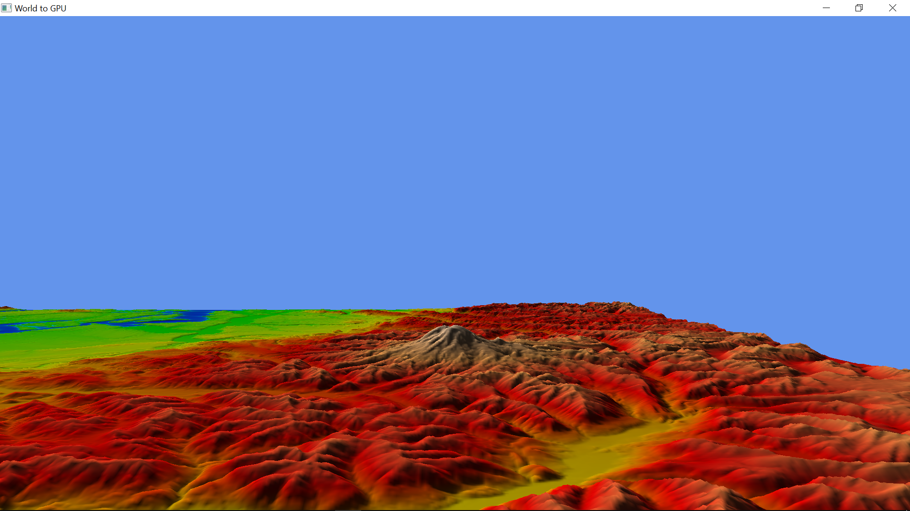
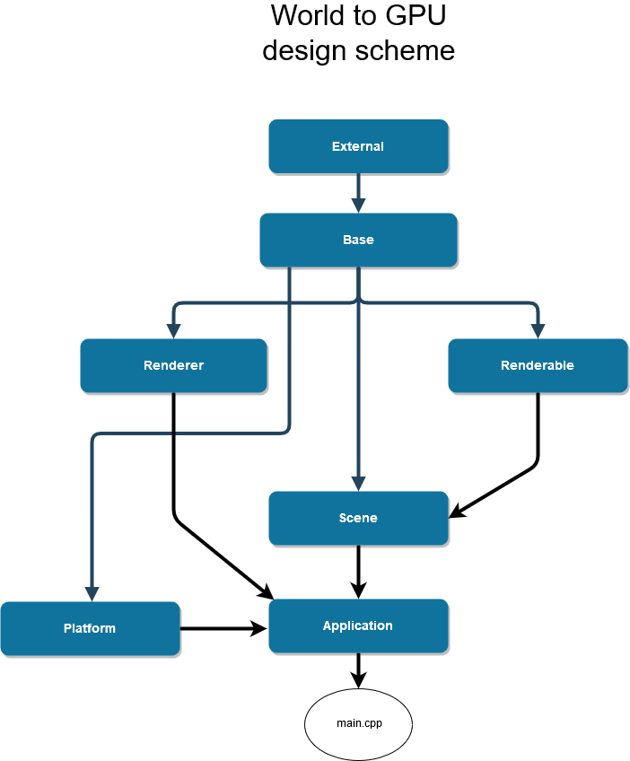

# World to GPU - Real-time rendering of outdoor scenes using Vulkan API.
  

## Table of contents
* [General info](#general-info)
* [Technologies](#technologies)
* [Usage](#usage)
	* [Usage example](#usage-example)
	* [For developers](#for-developers)
* [Scene file description](#scene-file-description)
	* [Asset](#asset)
	* [Cameras](#cameras)
		* [Perspective](#perspective)
		* [Orthographic](#orthographic)
* [Settings file description](#settings-file-description)
* [Dependancies](#dependancies)
* [Development](#development)
	* [Goals](#goals)
	* [Shader compilation](#shader-compilation)
	* [Code organization and design philosophy](#code-organization-and-design-philosophy)
		* [External](#external)
		* [Application](#application)
		* [Platform](#platform)
		* [Base](#base)
		* [Renderer](#renderer)
		* [Renderable](#renderable)
		* [Scene](#scene)
		* [GUI](#gui)
	* [Renderer design decisions](#renderer-design-decisions)
	* [Module interaction scheme](#module-interaction-scheme)
* [Author](#author)
## General info
*Vulkan* is a new powerful low-level graphics API that allows developers to design high-performance rendering engines in 
a way that is different from the way it was done before. But with great power come great responsibilities.
*World2GPU* project explores how the flexibility of a low-level rendering API can be put to use when designing real-time high-performance
graphical applications. 
### Technologies
*World2GPU* is developed in C++ and compiled with C++17 compatable compiler.
The application is tested with Visual Studio 2019, however, any C++17 compiler should work. 
*Vulkan* is used as a rendering API.
### Usage
Vulkan 1.0+ compatable graphics card and drivers should be installed on a machine.  
To use *World2GPU* application, launch executable file and provide command line arguments to specify
file name of a scene to be rendered *(option -s)* and whether to use GUI *(option -g)*.  
Scene description file should be present in *'/scenes'* folder.  
Application settings are stored in *'ini/settings.json'* file.  
To move around the scene use *W*, *S*, *A*, *D*, *R* and *F* keys on the keyboard; mouse - to look around.
#### Usage example
To start rendering the scene described in 'scenes/scene_alpha.json' file write:
> WorldToGPU.exe -s scene_alpha.json
#### For developers
In Visual Studio: after cloning the repo go to *'Project properties'* and select *'Debugging'* section:  
- Add *'Command arguments'* as described above.
- Set *'Working directory'* to location of the application .exe file.
### Scene file description
Scenes are described in *.json* files with the following pseudo-structure:
```javascript
{
	"asset": {
		"version": "1.0"
	},

	"camera": {
		...	
	}
}
```  
Each of the items are described below.
#### Asset
Used as a meta-information of the scene file.
```javascript
"version": "1.0"
```    
Version of the file structure. Used internally to identify the file.
#### Cameras
Cameras define the vantage points of the scene. There can be only one camera per scene.  
There are two camera types:  
- Perspective
- Orthographics  
##### Perspective
To describe perspective camera use:  
- *'type'* property defines the type of the camera.
- *'translation'* describes the position of the camera in 3d space.
- *'yfov'* property defines vertical field-of-view of the camera and is defined in radians.  
- *'zfar'* far clipping plane.
- *'znear'* near clipping plane.

```javascript
"camera": {
	"type": "perspective",
	"perspective": {
		"yfov": 0.7,
		"zfar": 100,
		"znear": 0.01
	},
	"translation": [ 0.5, 0.5, 3.0 ]
}
```  
Camera, by default, is pointed to negative Z direction.
##### Orthographic
To describe orthographic camera use:  
- *'type'* property defines the type of the camera.
- *'translation'* describes the position of the camera in 3d space.
- *'zfar'* far clipping plane.
- *'znear'* near clipping plane.  
- *'xmag'* width af the viewing volume.
- *'ymag'* height af the viewing volume.

```javascript
"camera": {
	"type": "orthographic",
	"orthographic": {
		"yfov": 0.7,
		"zfar": 100,
		"xmag": 1.0,
		"ymag": 1.5
	},
	"translation": [ 0.5, 0.5, 3.0 ]
}
```  
### Settings file description
Setting describe properties of the application. The file *settings.json* is located in *'/ini'* folder
relative to projects executable file. The description of the properties is as follows:
```javascript
{
"windowSize": [ 800, 600 ],
"fullscreen": false,
"renderer": {
	"appName": "World to GPU",
	"appVersion": 1,
	"engineName": "W2GPU",
	"engineVersion": 1,
	"framesInFlight": 2
}
}
``` 
- *'windowSize'* size of the output screen in pixels.
- *'fullscreen'* whether the application runs in fullscreen mode.
- *'appName'* name of the application. Used internally as identifier and as an output window title. 
- *'appVersion'* version of the application. 
- *'engineName'* name of the engine that this application uses. Used by Vulkan drivers to optimize if it is
well known engine. Has no effect in our case.
- *'engineVersion'* version of the engine used.
- *'framesInFlight'* technical parameter that describes how many frames are processed simultaneously by the GPU. Can 
affect performance.
### Dependancies
The dependancies are:  
- Vulkan SDK.
- GLFW multi-platform library for creating window, loading Vulkan, receiving input.
- [GLM](https://github.com/g-truc) optimized linear math library.
- [JSON](https://github.com/nlohmann) library.
- [AMD](https://github.com/amd) vulkan memory allocation library.  
- [Stb](https://github.com/nothings/stb) image loader library.  
- [IMGUI](https://github.com/ocornut/imgui) user interface library.  

All libraries are included in the project.
### Development
#### Goals
The development is guided by two main goals:
- real-time performance
- photorealism  

Real-time performance is achieved using the power of modern C++ and Vulkan 3d API for optimal GPU utilization. 
Photorealism is achieved using modern rendering techniques that are real-time aproximations of physically-based approach to rendeing.
#### Shader compilation
Shaders are written in GLSL language Vulkan *dialect*. Source code for the shaders is in *'/shader'* folder
in project root directory. Shaders are compiled to *.spv* format using *glslangValidator.exe* that can be found in VulkanSDK and 
are then placed in *'/shaders'* folder in *'/product'* directory.
#### Code organization and design philosophy
Project source code is divided into the following modules. Each module is placed in separate subfolder in *'/src'* directory.
##### External
Contains external libraries that are used in the project.
##### Application
The main application container. Stores and runs main modules of the application. There can be multiple applications
defined but only can be active at a time.
##### Platform
Contains platform related functionality. Defines base class for all applications that are to be defined. This base class
provides basic OS related functionality that is common among different applications and has no need to be duplicated.
##### Base
Lowest level module that provides basic type definitions and common functionality like logging, file loading, parsing etc.
All other modules are built on top of it.
##### Renderer
Renderer module is concerned with rendering whatever it is told to. It is *blind* to the rest of the engine in a sence that
it knows nothing about the objects to be rendered and nothing about the properties of the scene. All objects, however, *use* the renderer
to draw themselves.  
Renderers source code, by and large, consists of Vulkan API abstractions and Vulkan concept abstractions
that are not dependant on the underlying API. 
##### Renderable
Renderables are objects to be rendered by the application. All objects have base class that they inherit from which allows
renderables to be processed in a common way. Renderables store information about themselves and *know* how to use *'renderer'*
module to render themselves.
##### Scene
This module is concerned with organization of the scene and delegation of the tasks to various parts of the engine.
'Scene manager' can be thought as the *'king'* submodule of the engine for it tells other submodules what to *do*
and how to *act*. It is the highest level submodule in the engine.  
Scene submodule itself merely generates and stores the scene description.  
Camera definitions are also contained in the *scene* module.
##### GUI
GUI mddule implements renderer of a GUI and it's integration into existing appliction. GUI can be completely disabled
with command line option.  
Actual user interface specification is left for the each individual engine entity and GUI module gathers and renders it.
#### Renderer design decisions
Given Vulkan API low-level design philosophy, the most complex part of this engine is the renderer. The complexity can be
managed by implementing higher-level abstractions and such abstractions inevitably lead to countless renderer design decisions along the way. Some
of those decisions are presented and explained below:
##### Frames-in-flight
To (dramatically) speed up the rendering process frames can be processed in parallel, that is, prepare one frame while other 
is being rendered and vice versa.  
The number of frames in parallel (or frames-in-flight) are determined in settings. Some applications tie them to swapchain image count 
but this is debatable since swapchain image count can be different from one machine to another. Usually the count is set to two or three frames
processed in parallel.  
Apart from usual API call synchronization, to avoid data-race problems each frame-in-flight *gets* it's own copy of dynamic resources.
Example of such resources are command buffers, uniform buffers etc.  
Modules that store resources per frame-in-flight are:  
- Frame manager -> Frame resources
- Shader resources  

Frame-in-flight count can not be changed during application execution.
##### Pipeline management
Naive approach is to create a pipeline for each mesh, but there are a couple of problems associated with this approach.
First, many objects can have the same pipelines and storing their copies would be inefficient, to solve this local pipeline caching is implemented 
(not to be confused with pipeline cache Vulkan object). Pipelines are stored in a single container and referenced in renderable objects that use them.
Another reason to store pipelines in a single location is simplicity when it comes to pipeline recreation which should be done every time the screen
size changes (pipelines depend on screen size).
##### Shader resource management (descriptors)
Shader resources are managed through shader resource module; renderable modules only store id's or references to those 
managed resource objects.  
Shader resource module stores descriptor set layout cache that is used to cache common layouts and reuse 
them. Note that caching *destroys* total layout description set count, that is later used to initialize descriptor 
set pool, so it is counted again per cache object creation as a statistics.  
Per frame-in-flight data for this module is:
- all uniform buffers used in application
- descriptor pool used to allocate all descriptor sets
- all descriptor sets used in application  

Data is initialized during initialization phase and is not modified during application hot-loop. 
#### Module interaction scheme
  

## Author
Designed and developed by [Ivars Rusbergs.](https://github.com/ivarsrb)